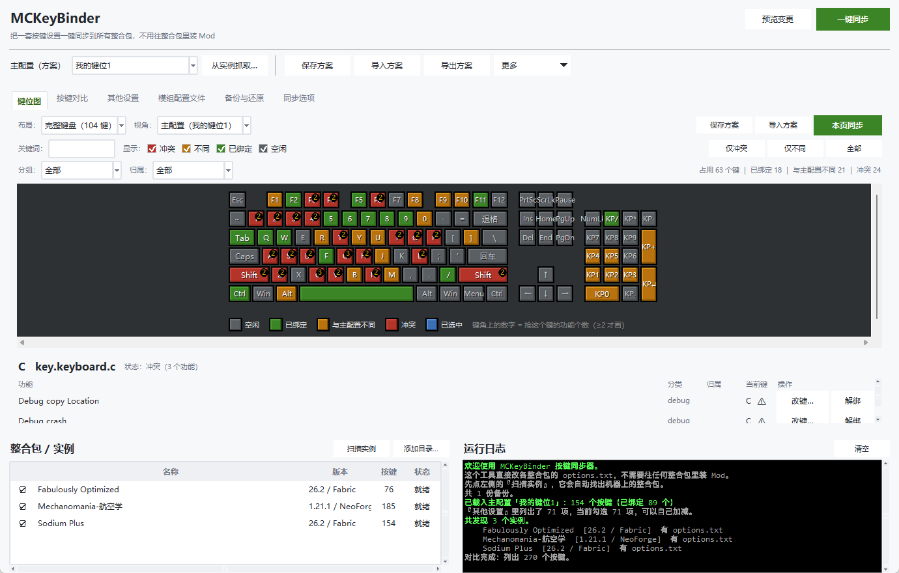
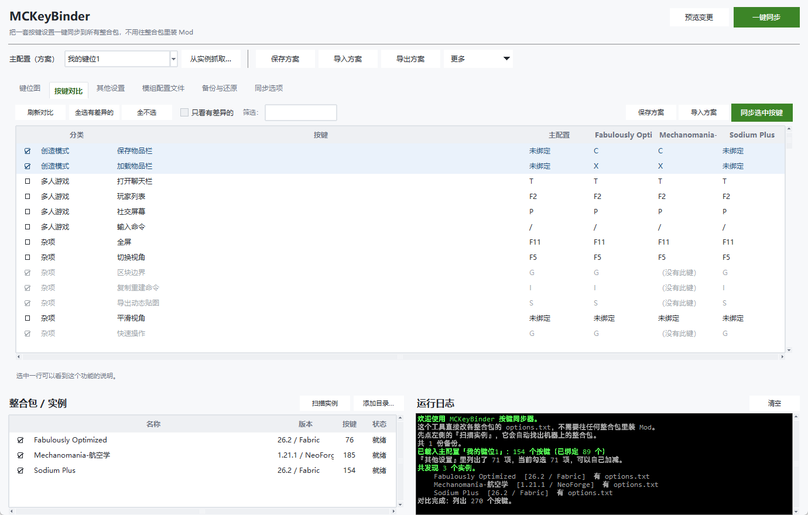
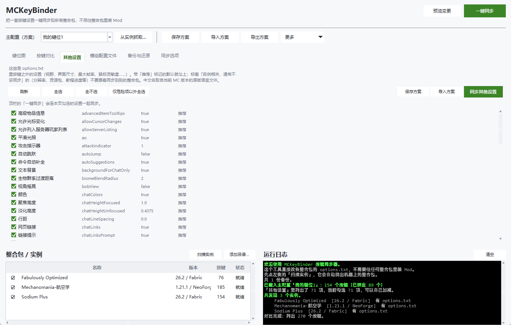
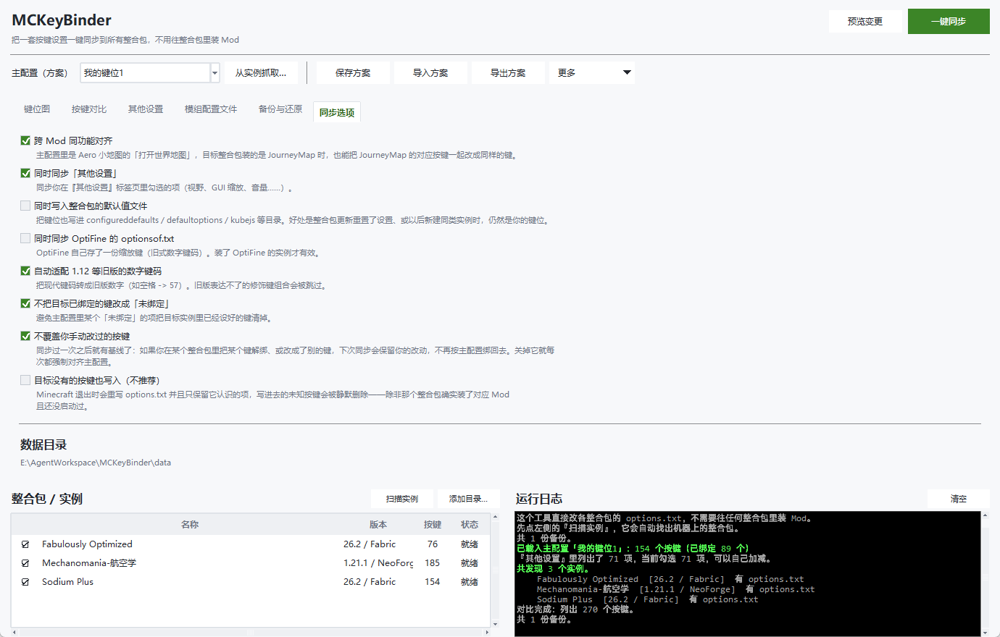
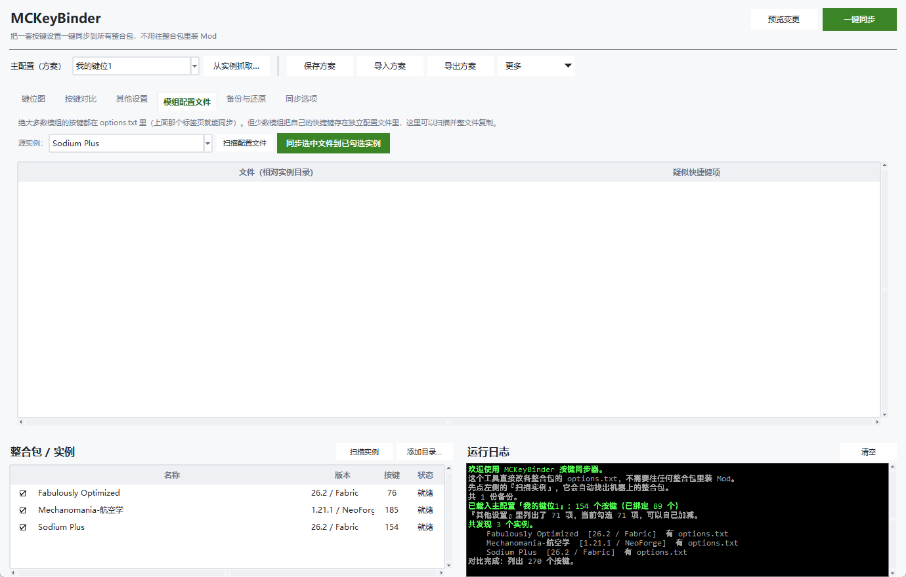
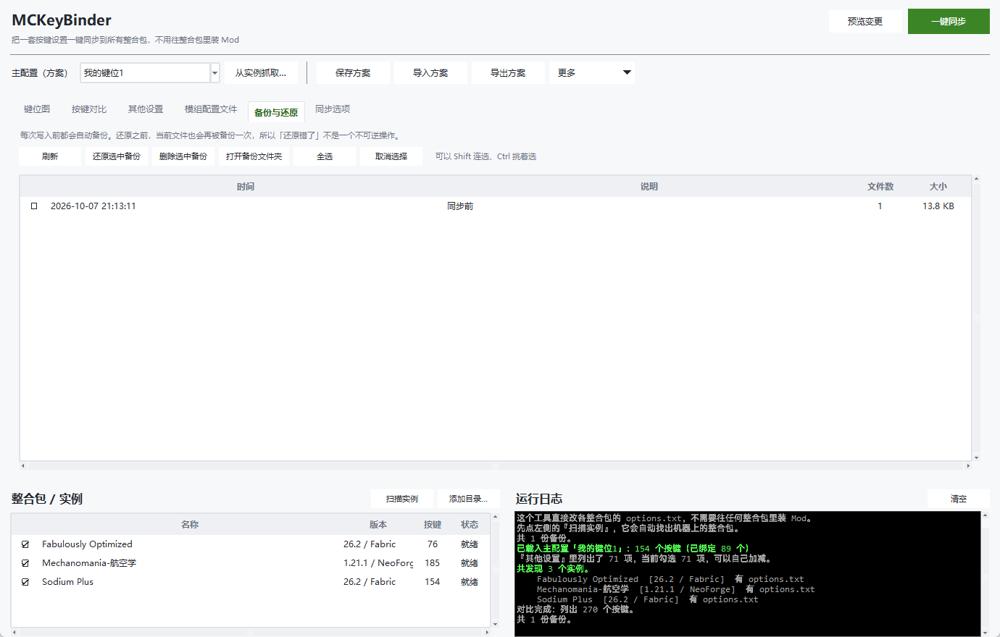

# MCKeyBinder 按键同步器

把同一个按键设置**一键同步到多个 Minecraft 整合包**，**不需要往任何整合包里装 Mod**。

换整合包就要重设一遍疾跑、潜行、打开背包……这个问题社区里有十几种 Mod 方案，
但它们**全都要求每个整合包都装那个 Mod**，而这正是你想避免的麻烦。
本项目换了个思路：**直接改各整合包的 `options.txt`**，因此对整合包零侵入、跨加载器、跨启动器。

```
                     ┌─────────────────┐
   从任意整合包  ───▶ │   主配置 (JSON)  │ ───▶ 一键推送到任意多个整合包
   抓取键位          └─────────────────┘
```

---

## 界面

| 键位图 | 按键对比 |
|---|---|
|  |  |

| 其他设置 | 同步选项 |
|---|---|
|  |  |

| 模组配置文件 | 备份与还原 |
|---|---|
|  |  |

## 它解决什么

| 场景 | 本工具怎么做 |
|---|---|
| 原版按键（疾跑/潜行/背包/视角…） | 直接同步，全自动 |
| 两个整合包**都有同一个小地图 Mod** | 按键名相同，精确匹配，直接同步成 `M` 键 |
| 两个整合包装的是**不同的小地图 Mod** | 内置「同功能」映射表：Xaero 的「打开世界地图」↔ JourneyMap 的「全屏地图」也能对齐 |
| 一个整合包是 1.21、另一个是 1.12 | 自动做键码转换（`key.keyboard.space` ↔ `57`），旧版表达不了的组合键会明确跳过 |
| 整合包更新/重装后键位被重置 | 可以把键位同时写进 `configureddefaults` / `defaultoptions` / `kubejs` 默认值文件 |
| 少数 Mod 把快捷键存在自己的配置里 | 「模组配置文件」标签页扫描并整文件复制 |
| 在某个整合包里手动解绑/改过的键 | 靠**同步基线**认出来并保留，不再按主配置绑回去 |
| 只想同步「最大帧率 / 鼠标灵敏度 / 屏幕扭曲效果」这类设置 | 「其他设置」页勾选即可，推荐项默认已勾上 |

## 为什么不需要装 Mod

`options.txt` 是纯文本，按键行长这样：

```text
key_key.sneak:key.keyboard.left.shift
key_gui.xaero_open_map:key.keyboard.m
key_key.jei.toggleOverlay:key.keyboard.o:CONTROL
```

**绑定名相同 ⇒ 就是同一个功能**。所以「同一个 Mod 的按键」天然能对上，不需要 Mod 参与。
只有「不同 Mod 的同类功能」才需要一张人工映射表（见 `mcsync/semantic.py`）。

---

## 安装

### 方式一：下载现成的 exe（推荐）

到 [**Releases**](https://github.com/Lkig/MCKeyBinder/releases) 页面下载，**不用装 Python**：

| 文件 | 说明 |
| --- | --- |
| `MCKeyBinder-1.0.0-win64.zip` | 解压后双击里面的 `MCKeyBinder.exe`。启动快，推荐 |
| `MCKeyBinder.exe` | 单文件版，就一个 exe。启动时会自解压，慢一两秒 |

两种都是**绿色版**：第一次运行会在 exe 旁边建一个 `data/` 目录放主配置、备份和缓存，
想搬到别的电脑就把整个文件夹（或那个 exe）拷走。删掉 `data/` = 恢复出厂设置。

### 方式二：从源码跑

**只需要 Python 3.9 或更高版本**（[python.org](https://www.python.org/downloads/windows/) 下载，
安装时记得勾上 *Add python.exe to PATH*）。**不需要装任何第三方库**——
整个工具只用标准库，连 `pip install` 都不用跑。

```bash
git clone https://github.com/Lkig/MCKeyBinder.git
cd MCKeyBinder
python main.py
```

不想用 git 就点右上角 **Code → Download ZIP** 解压，然后双击 `main.py`。

> 第一次运行后会自动生成 `data/` 目录存放主配置、备份和缓存，删除它等于恢复出厂设置。
>
> 想自己打包 exe：`python -m venv .venv` → `.venv\Scripts\python -m pip install -r requirements-build.txt`
> → `.venv\Scripts\python tools\build_exe.py`（加 `--onedir` 出目录版，加 `--console` 出一个带黑框的排错版）。

---

## 快速开始

### 图形界面

双击 **`启动按键同步器.lnk`**（或 **`启动按键同步器.pyw`**）。需要 Python 3.9+，不需要装任何第三方库。

> `启动按键同步器.lnk` 是**本机生成**的（里面写死了 Python 和项目的绝对路径），
> 所以没跟仓库一起走。想要一个就 `python tools/build_assets.py` —— 它会创建快捷方式、
> 顺手重画图标，并生成 `assets/app.ico`。`.pyw` 和 `main.py` 都是通用的，直接双击即可。

> `启动按键同步器.bat` 也能用，但它会先闪一个黑色控制台窗口，而且 `.bat` 属于 Windows
> 硬编码的「可执行模板」类型——一旦文件带上「来自 Internet」标记（MOTW）就会弹
> 「无法验证发布者」的黄框。所以默认的启动方式是上面那个快捷方式 / `.pyw`。
> `.bat` 留着是为了排错（出错时它会停住显示完整报错），也方便在命令行里看输出。
> 万一真的看到黄框，双击 **`修复安全警告.pyw`** 即可（它会扫掉项目目录里所有 MOTW 标记，
> 顺手把桌面快捷方式补回来；加 `--check` 只查不改）。

界面是「左实例 + 右标签页」的现代扁平布局，保留 Minecraft 的灰/绿配色：

* **顶栏**：主配置下拉框（+ 从实例抓取…）、方案区的 保存方案 / 导入方案 / 导出方案 / 更多 ▾，
  右上角是 **预览变更** 与绿色的 **一键同步**。
* **每个标签页自带一排动作按钮**（保存方案 / 导入方案 / 本页同步），
  只同步当前这一页的东西，跟顶栏的「一键同步」区分开。
* 窗口大小、最大化状态、两个分栏位置、上次停留的标签页、运行日志是否展开 —— **都会记住**。
* 键位图会**跟着窗口高度自适应**：地方不够时先收起鼠标区和图例，再缩小键帽，尽量不让键盘需要滚动。
* 窗口 / 任务栏图标是一颗**长得像草方块的键帽**：带黑边、左上白高光、右下灰阴影的键帽倒角，
  正面是随机锯齿边界的草皮 + 泥土像素格（`tools/build_assets.py` 用 Pillow 直接画的，
  每个尺寸单独渲染，16×16 也认得出）。

1. 点左上角 **扫描实例** —— 会自动找出 PCL2 / HMCL / 官方启动器 / Prism / CurseForge /
   Modrinth App / ATLauncher / GDLauncher 的整合包。找不到就用 **添加目录…** 手动指定。
2. 点 **从实例抓取…** —— 挑一个你**已经调好按键**的整合包，存成一份「主配置」。
   （主配置可以 **重命名 / 导入 / 导出 / 删除**，一份 JSON 就能带着走。）
3. 在左边勾选要同步到哪些整合包。
4. 点 **一键同步**（可以先点 **预览变更** 看看会改什么）。

### 六个标签页

| 标签页 | 干什么 |
|---|---|
| **键位图** | 把键盘、鼠标画出来，看每个键被谁占用；就地改键/解绑主配置 |
| **按键对比** | 主配置 vs 每个整合包的逐条差异表，勾选要同步哪些条目 |
| **其他设置** | 视野、界面尺寸、最大帧率、鼠标灵敏度……这些非按键选项（**显示中文名**，原始英文名放在右边灰色小字；推荐项默认已勾上） |
| **模组配置文件** | 扫描把快捷键藏在自己配置里的 Mod，整文件复制 |
| **备份与还原** | 每次写入前的自动备份，一键还原到任意历史点 |
| **同步选项** | 同功能对齐、旧版键码转换、写默认值文件、**不覆盖你手动改过的按键**、重置同步基线 |

### 「不覆盖你手动改过的按键」（同步基线）

只比较「主配置」和「目标文件」是不够的：**整合包默认就没绑这个键**（该绑上）
和**你刚在游戏里故意解绑了**（不该绑回去），在文件里长得一模一样。

所以引入第三份信息——**同步基线**：每次同步写完之后，把目标实例当时的键位快照
记进 `data/sync_state.json`。下次同步时，凡是和基线不一致的条目就说明
「上次同步之后被人动过」，于是保留现状并归入 `skipped`（日志里会写明原因）。

* 没有基线（从没同步过）时一切照旧，第一次同步不会退化成什么都不做。
* 零改动的实例也会一起记基线，所以「同步 → 游戏里改键 → 再同步」能保住改动。
* 关掉它（或点「重置同步基线」／命令行 `--force-align`）就恢复成每次强制对齐。

### 「键位图」页

这是对标两只可视化按键 Mod（`[VK] 可视化键位图` 与 `可视化按键绑定管理`）做的，
但**不用装 Mod**，而且在游戏外就能改：

* **键盘 / 鼠标布局可视化**，两种键盘布局（104 键完整 / 87 键紧凑），鼠标单独一区。
* **颜色即状态**：灰＝空闲、绿＝已绑定、橙＝与主配置不同、红＝**冲突**（多个功能抢同一个键）、
  蓝＝当前选中。键角上的数字＝抢这个键的功能个数（≥2 才画）。
* **过滤**：按视角（主配置 / 任意实例）、分组（Mod 分类）、归属（属于哪个 Mod）、
  关键词、状态（可勾选「仅冲突」「仅不同」）。
* **详情面板**：点一个键，列出占用它的每个功能——显示名、分类、归属 Mod、当前键值，
  并可直接 **改键…**（弹出按键选择器，支持直接按键盘捕捉）或 **解绑**；改完自动更新主配置。
* 切到「实例视角」时是只读的，只告诉你那个整合包现在是什么样。

> 实测一个 185 Mod 的整合包：179 个按键里有 **68 个键被占用，其中 19 个是冲突**
> （最夸张的 `鼠标左键` 被 8 个功能同时占用）。这种冲突是整合包默认值自带的，
> 平时在游戏里根本看不出来——这正是键位图页最有价值的地方。

### 命令行

```bat
命令行.bat list                          :: 列出发现的实例
命令行.bat capture 1 -n 我的键位           :: 把实例 1 的键位存成主配置
命令行.bat diff 我的键位                   :: 打印差异对比表
命令行.bat sync 我的键位 --all -y          :: 一键同步
命令行.bat backups / restore 1            :: 备份与还原
命令行.bat selftest                      :: 合成数据自测（不碰真实整合包）
```

也可以直接用 Python：

```bash
python cli.py --help
python main.py
```

---

## 安全性设计（每一条都对应一个真实的坑）

这些不是「保险起见」，而是调研中确认过的、会让工具**静默毁掉你的键位**的具体机制：

1. **只写目标整合包已经认识的按键。**
   Minecraft 每次保存 `options.txt` 时**只写它自己认识的项**——不认识的 `key_*` 行会被静默删除。
   所以往没装某 Mod 的整合包里写它的按键毫无意义（下次进游戏就没了），本工具默认跳过并告知。
2. **绝不整文件替换，只按条目 merge。**
   未知行、注释、顺序全部原样保留。借鉴 `Configured Defaults` 的做法。
3. **UTF-8 无 BOM + 沿用原换行符（实测为 CRLF）+ 保留末尾换行。**
   编码或换行写错会让 Minecraft 判定文件损坏并**整份重置选项**。
4. **写前备份、写后回读校验。**
   不是「以为写进去了」，而是重新读一遍确认每个按键都真的生效。校验不过就报错。
5. **检测游戏是否在运行。**
   游戏启动时、每次改设置时都会回写 `options.txt`，运行中同步必被覆盖。
6. **键值合法性自校验。**
   `InputConstants.getKey()` 遇到不认识的字符串会直接抛异常；非法值一律不写。
7. **跨版本转换不猜。**
   无法确定的旧版键码（如日文键盘专有键）会**跳过并报警**，而不是写一个猜测值。
8. **所有配置写入都是原子的。**
   临时文件名带进程号（`xxx.<pid>.<n>.tmp`）再 `os.replace`，失败按退避重试。
   之前用固定名 `mods.tmp`，两个整合包先后触发保存时会在 Windows 上撞
   `[WinError 32] 另一个程序正在使用此文件`。
9. **不覆盖你同步之后手动改过的按键。**
   没这条的话，「整合包默认没绑」和「你刚在游戏里解绑」在文件里无法区分，
   同步就会把你特意解绑的键（比如截图键）又绑回去。做法见上面的「同步基线」。
10. **只同步哪些「其他设置」由你说了算，而且默认不越界。**
    顶栏的「一键同步」默认只动按键；要带上设置得显式打开。
    被标为「实例相关」的项（分辨率、资源包、教程进度等）默认不勾。

---

## 项目结构

```
MCKeyBinder/
├─ 启动按键同步器.lnk / .pyw            双击即用（无控制台、无安全警告）
├─ 修复安全警告.pyw                    扫掉 MOTW 标记并重建桌面快捷方式（--check 只查不改）
├─ 启动按键同步器.bat / 命令行.bat       命令行入口（排错时用，会停住显示报错）
├─ main.py                            统一的启动入口（异常弹窗而不是闪退）
├─ cli.py                             命令行入口
├─ gui/
│  ├─ app.py                          图形界面主窗口 + 六个标签页
│  ├─ mcstyle.py                      扁平主题：配色、按钮、自绘复选框、提示框
│  ├─ keymap.py                       键盘+鼠标的可视化画布（按高度自适应）
│  ├─ keymap_tab.py                   「键位图」页：过滤、详情面板、就地改键
│  ├─ dialogs.py                      按键选择器（支持直接按键捕捉）
│  └─ widgets.py                      带勾选列的 Treeview、日志框等控件
├─ mcsync/                            核心库（无第三方依赖，纯标准库）
│  ├─ optionsfile.py                  options.txt 保真读写（保序/保编码/保换行）
│  ├─ atomicio.py                     带重试的原子写（临时名带 pid，避免撞车）
│  ├─ keycodes.py                     键码模型、显示名、合法性校验
│  ├─ legacy_codes.py                 1.12 数字键码 ↔ 1.13+ 命名键码
│  ├─ instances.py                    实例发现（各启动器路径 + 有界磁盘扫描）
│  ├─ modscan.py                      读 mod jar（含 jar-in-jar）与语言文件
│  ├─ naming.py                       把 key_gui.xaero_open_map 变成「打开世界地图」
│  ├─ mclang.py                       从原版资源索引里取 zh_cn.json，给设置项配中文名
│  ├─ semantic.py                     同功能跨 Mod 映射表
│  ├─ keymap_model.py                 键位占用模型（哪个键被谁占了 / 有没有冲突）
│  ├─ profile.py                      主配置的数据模型与 JSON 读写
│  ├─ diff.py                         差异对比 + 冲突检测
│  ├─ sync.py                         生成计划、备份、写入、校验（含手动改动保护）
│  ├─ state.py                        同步基线：记住上次同步后各实例的键位
│  ├─ backups.py                      备份与还原
│  ├─ configfiles.py                  模组自有配置文件的扫描与复制
│  └─ app.py                          应用门面（GUI/CLI 共用状态）
├─ tools/
│  ├─ build_assets.py                 生成 MC 风格图标（assets/app.ico）与快捷方式
│  ├─ preview_icon.py                 把 ico 各档尺寸拼成对比图
│  └─ keymap_preview.py               离线预览键盘控件
├─ tests/
│  ├─ selftest.py                     139 项端到端自测（合成实例，不碰真实数据）
│  ├─ gui_smoke.py                    GUI 冒烟测试（建真窗口走完主流程）
│  ├─ ui_shot.py                      给每个标签页截图（文档用，支持 --geometry）
│  └─ perf_probe.py                   各主要流程计时 + cProfile 热点（--cold 测冷启动）
├─ assets/app.ico                     应用图标
├─ docs/
│  ├─ 调研报告.md                      已有方案盘点 + 文件格式规格（含出处链接）
│  └─ images/                         界面截图
└─ data/                             自动生成：主配置、备份、缓存、设置（已 gitignore）
```

## 自测

```bat
命令行.bat selftest
```

`tests/selftest.py` 会现场造出 5 个合成整合包（现代/旧版/缺 Mod/带 BOM 等），
然后验证读写保真、键码转换、jar-in-jar 扫描、命名解析、差异对比、同步写入、
跨版本降级、备份还原、幂等性、同步基线的手动改动保护等 —— **139 项检查**。
`tests/gui_smoke.py` 则把界面真的建起来、灌入数据、走完主要流程（含键位图过滤、
就地改键、主配置重命名、其他设置默认勾选等）。`tests/ui_shot.py` 负责把每个标签页截图存到 `docs/images/`。

两者都不会碰你机器上的真实整合包。

## 已知边界

* **不覆盖自带键位系统的客户端 Mod。** Wurst 把键位存在 `wurst/keybinds.json`、
  Meteor 存在 `meteor-client/*.nbt`。这类可以用「模组配置文件」标签页整文件复制。
* **OptiFine 的 `optionsof.txt`** 是一份独立的、用旧式数字键码的文件，
  需要在「同步选项」里单独打开。
* **Fabric 不支持修饰键组合**（Forge 的 `Ctrl+J` 在 Fabric 上是 `M`），
  跨加载器同步时这类语义差异无法自动消除。
* PCL2 装在自定义路径时，靠**有界磁盘扫描**或手动添加目录来发现。

## 调研与参考

完整盘点（13+ 个 Mod 方案、各启动器能力、`options.txt` 格式规格、出处链接）见
[`docs/调研报告.md`](docs/调研报告.md)。

被借鉴的设计：

| 来源 | 借鉴了什么 |
|---|---|
| [Configured Defaults](https://modrinth.com/mod/configured-defaults) | `options.txt` 按条目 merge，绝不整文件替换 |
| [Just Universal Keybinds](https://modrinth.com/mod/just-universal-keybinds) | 「同功能不同 Mod 的按键可以归为一组」这一交互目标 |
| [Options Enforcer](https://www.mcmod.cn/class/14755.html) | 「只设一次」与「每次强制」两种语义 |
| [OptionSync](https://github.com/Ellpeck/OptionSync) | 「命名存档位 + 载入」的交互模型 |
| [FCL 启动器](https://www.bilibili.com/video/BV1UH4y1d7qx) | 「键位分享码」这种可携带的配置形态 |
| [RememberMyTxt](https://modrinth.com/mod/remember-my-txt) | 搞清楚了「MC 只保存自己认识的值」这条关键语义 |
| [[VK] 可视化键位图](https://www.mcmod.cn/class/23703.html) | 用键盘布局展示键位绑定 |
| [可视化按键绑定管理](https://www.mcmod.cn/class/27226.html) | 按 Mod/状态/关键词过滤 + 详情面板 + 冲突着色 |

---

## 许可

[MIT](LICENSE)。`options.txt` 的格式规格来自对 Minecraft 与
[Configured Defaults](https://modrinth.com/mod/configured-defaults)
等开源项目的阅读，本项目不含任何 Mojang 代码或资源。

